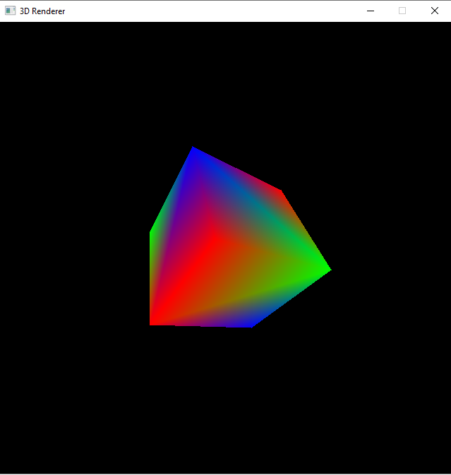

# 3d_renderer
A software 3d renderer built with SDL. Only input handling and draw_pixel is used from SDL. The project was developed to understand how a GPU works.

Features:
1. Drawing lines
2. Triangle rasterization
3. Color interpolation between vertices
4. Transforms, Scaling, Rotations

